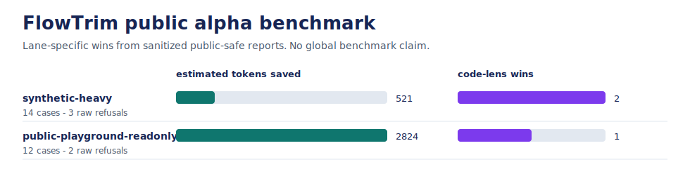

# FlowTrim

Lane-specific context trimming for AI coding agents: reduce noisy context when
facts can be preserved, and keep raw evidence when exact output matters.

FlowTrim is a public alpha candidate. It is ready for local skill install,
public-safe proof runs, docs checks, privacy gates, and pinned-corpus
experiments. **No global benchmark claim** is made.



## Numbers

Public-safe snapshot generated from sanitized reports:

| Profile | Cases | Token wins | Tokens saved | Raw refusals | Code-lens wins | Claim boundary |
| --- | ---: | ---: | ---: | ---: | ---: | --- |
| `synthetic-heavy` | 14 | 4 | 521 | 3 | 2 | Public-safe fixture evidence |
| `public-playground-readonly` | 12 | 8 | 2,824 | 2 | 1 | Public-safe usability smoke |

Measured token counts come from the same packet text the `flowtrim-trim` CLI
ships, so scoreboard savings match real usage. Read the full method and caveats
in [benchmarks/results/2026-07-09-public-alpha.md](benchmarks/results/2026-07-09-public-alpha.md)
and [docs/benchmark-results.md](docs/benchmark-results.md); the previous
snapshot stays at
[benchmarks/results/2026-06-19-public-alpha.md](benchmarks/results/2026-06-19-public-alpha.md).

## Install

Official install path: Codex.

```bash
git clone https://github.com/ozifer33/flowtrim.git
cd flowtrim
python3 -m pip install .
node scripts/flowtrim-skill-install.mjs --agent codex --scope user
flowtrim-benchmark doctor --format json
```

For project-local Codex install:

```bash
node scripts/flowtrim-skill-install.mjs --agent codex --scope project --project .
```

Other agent paths are compatibility notes, not primary install claims. See
[docs/install.md](docs/install.md).

## Trim Real Output

`flowtrim-run` wraps a command and prints token-reduced output. The command's
exit code is the pass/fail ground truth and is propagated, so CI chaining keeps
working:

```bash
flowtrim-run -- npm test
flowtrim-run --must-preserve "tests/test_api.py::test_create" -- pytest -q
```

Passing runs become a compact fact packet; failing runs keep a bounded error
excerpt by default (`--trim-on-fail` and `--raw-on-fail` change that policy).

`flowtrim-trim` is the fail-safe reducer for output you already captured. It
emits a compact fact packet only when preservation and token gates pass, and
prints the raw input unchanged otherwise, so pipelines never lose evidence:

```bash
npm test 2>&1 | flowtrim-trim
flowtrim-trim --file /tmp/build.log --must-preserve "src/worker.py::test_retry_policy"
flowtrim-trim --file /tmp/unknown-tool.log --fallback excerpt --format json
```

- Exit code stays `0` for both `trimmed` and `raw` decisions, and every
  `--must-preserve` fact must survive verbatim or the raw input is returned.
- `--lane exact-evidence` (or an exact-evidence `--task`) always passes raw
  output through; `--lane long-context` keeps trace/source/job ids auditable.
- `--fallback excerpt` keeps a head/tail/error-window excerpt with omission
  markers when the packet gates fail, instead of returning the full raw log.
- The packet extractor understands pytest, Jest/Vitest, Go, Cargo, tsc, and npm
  log shapes, and falls back safely on anything else. The stderr stats line
  reports measured savings per run, for example
  `flowtrim-trim: trimmed 155 -> 63 tokens (59.4% saved)` on the repository's
  own `benchmarks/fixtures/logs/noisy-build-fail.txt` fixture.
- Token estimates count non-ASCII (Thai/CJK) text per character. For exact
  counts, install `pip install "flowtrim[tokens]"` and set
  `FLOWTRIM_TOKENIZER=tiktoken`.

## How It Works

FlowTrim routes each agent flow through the smallest safe lane:

1. `command-output`: compact noisy shell logs only when paths, errors, summaries,
   and failing test ids survive.
2. `code-generation`: use a Ponytail-style code-complexity lens to find
   delete-list opportunities without claiming direct token savings.
3. `long-context`: allow direct compression only when trace ids, source ids, job
   ids, requirements, and retrieval facts remain auditable.
4. `exact-evidence`: keep raw output for quotes, stack traces, line-level diffs,
   security evidence, failing validation, and explicit exact-output requests.

RTK, Ponytail, and Headroom stay optional baselines. FlowTrim can compare
against them when installed safely, but it does not claim to beat them globally.

## Run Proofs

```bash
flowtrim-benchmark suite --profile synthetic-heavy --format json
flowtrim-benchmark suite --profile public-playground-readonly --format json
flowtrim-benchmark docs-check --format json
flowtrim-benchmark privacy-scan --tracked --format json
flowtrim-benchmark doctor --format json
```

Pinned public-corpus proof is available after preparing a local cache:

```bash
flowtrim-benchmark public-corpus prepare --manifest benchmarks/public-corpus/manifest.v1.json --cache-root /tmp/flowtrim-public-corpus
flowtrim-benchmark suite --profile public-open-source-readonly --public-corpus-manifest benchmarks/public-corpus/manifest.v1.json --public-cache-root /tmp/flowtrim-public-corpus --format json
```

## Safety

- No private Work evidence is used as a public benchmark.
- No report may contain private paths, repo names, commit messages, source lines,
  raw diffs, `.env` values, or secret-like text.
- No token win counts unless preservation, runtime, and wall-time gates pass.
- Headroom skipped or unavailable is neutral, not a loss.
- Atlas remains the vault baseline while the vault verdict is `hybrid-only`.

## Development

```bash
python3 -m pip install -e .
python3 -m unittest discover -s tests
flowtrim-benchmark doctor --format json
```

## Source-Checkout Fallback

Before installing the package:

```bash
PYTHONPATH=src python3 skills/flowtrim/scripts/flowtrim_benchmark.py abcd
```

Contributing, security, and release hygiene:
[QUICKSTART.md](QUICKSTART.md),
[CONTRIBUTING.md](CONTRIBUTING.md),
[SECURITY.md](SECURITY.md),
[CHANGELOG.md](CHANGELOG.md).
